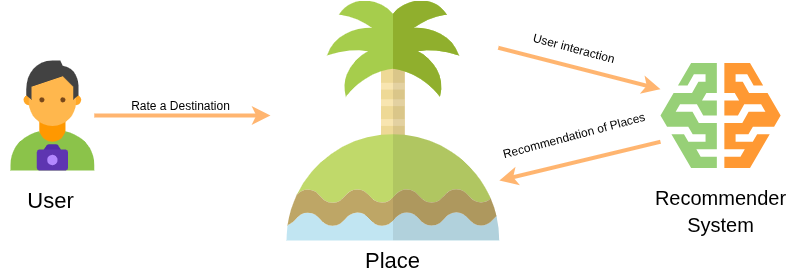

<div align="center">

  <!-- Project Logo -->
  

  <!-- Project Title -->
  <h1><b>Teman Wisata: Your Personalized Indonesian Travel Companion</b></h1>

  <!-- Project Tagline -->
  <h3>
    Stop scrolling, start exploring. Discover your dream destinations in Indonesia with personalized recommendations.
  </h3>

  <!-- Badges -->
  <p>
    
    
    <a href="https://app.teman-wisata.fun/">
      
    </a>
  </p>
  <br>
</div>

<!-- Table of Contents -->
<details>
  <summary><b>Table of Contents</b></summary>
  <ol>
    <li><a href="#-the-big-idea">The Big Idea</a></li>
    <li><a href="#-key-features">Key Features</a></li>
    <li><a href="#-live-demo--walkthrough">Live Demo & Walkthrough</a></li>
    <li><a href="#-technology--architecture">Technology & Architecture</a></li>
    <li><a href="#-running-it-locally">Running it Locally</a></li>
    <li><a href="#-the-team">The Team</a></li>
    <li><a href="#-whats-next">What's Next?</a></li>
  </ol>
</details>

---

## 🎯 The Big Idea

Every great project starts with a problem. Here's ours:

**The Problem:** The modern traveler faces a paradox of choice—an overwhelming amount of information when planning a trip. Sifting through countless blogs, reviews, and travel sites is time-consuming and often leads to visiting the same popular, overcrowded places. This "information overload" can diminish the travel experience and prevents tourists from discovering hidden gems that match their unique interests.

**Our Solution:** "Teman Wisata" (meaning "Travel Buddy") is a recommender system designed to solve this problem for tourism in Indonesia. By leveraging machine learning, our platform provides highly individualized travel recommendations. We analyze user preferences and interactions to suggest attractions across five major Indonesian cities: Jakarta, Yogyakarta, Semarang, Bandung, and Surabaya. Our goal is to simplify trip planning, enhance the traveler's journey, and promote a diverse range of local attractions.

<br>

## ✨ Key Features

Here's what our project can do. We focused on creating a seamless user experience through these core functionalities:


- **🎯 Personalized Recommendations:** After rating a few destinations, the system uses collaborative and content-based filtering to generate a personalized list of similar locations that are likely to appeal to the user.

- **📍 Rate Destinations:** Users can rate tourist attractions, which helps the system learn their preferences and improve the quality of future recommendations.
- **🏆 Discover Top Places:** See a curated list of the top-rated destinations and popular attractions by province to get inspiration for your next trip.
- **⚡ Fast & Responsive:** Implemented caching for the recommendation models to ensure users receive suggestions quickly and efficiently.
- **🔐 Secure Authentication:** A complete authentication system allows users to sign up, log in, and manage their own interaction data securely.


### 🔍 System Overview

<div align="center">
  
  <p><em>How our recommendation system works</em></p>
</div>

<br>

## 🚀 Live Demo & Walkthrough

Seeing is believing. Check out our project in action!

<div align="center">
  <a href="https://app.teman-wisata.fun/" title="Click to view the live application">
    
  </a>
  <p>
    <a href="https://app.teman-wisata.fun/"><b>Launch the Live Demo »</b></a>
    <br> • <br>
    <a href="https://www.loom.com/share/cdd6c48daee044bd881ce7eb637770b5?t=52&sid=8773bf8d-214b-4633-b9cc-d3cb542e8a23"><b>Watch our demo video »</b></a>
  </p>
</div>

### 📱 Application Screenshots

<div align="center">
  
  
  
  <br>

</div>

<br>

## 🛠️ Technology & Architecture

This project was built with a modern, scalable, and resilient MLOps stack. Our goal was to ensure high performance, reliability, and robust observability from development to production.

#### Core Technologies:

🛠️ Technology & Architecture
This project was built with a modern, scalable, and resilient MLOps stack. Our goal was to ensure high performance, reliability, and robust observability from development to production.
Core Technologies:

##### Backend & MLOps:

<p align="center">
<a href="#"></a>
<a href="#"></a>
<a href="#"></a>
<a href="#"></a>
<a href="#"></a>
<a href="#"></a>
<a href="#"></a>
<a href="#"></a>
</p>

##### Frontend:

<p align="center">
<a href="#"></a>
<a href="#"></a>
<a href="#"></a>
<a href="#"></a>
<a href="#"></a>
</p>

#### Architecture Overview:

Our system is designed as a microservices architecture, containerized and orchestrated with Kubernetes (K3s). The infrastructure is deployed on a single VM, prioritizing resource efficiency while maintaining full compatibility and scalability.

- **Frontend:** Built with **TypeScript, Alpine.js, Vite, Handlebars, Tailwind, and DaisyUI** for a responsive, fast, and efficient user interface.
- **Backend:** A high-performance RESTful API powered by **FastAPI** (Python), handling all business logic, data processing, and interactions with the ML models.
- **Database & Cache:** We use **Supabase** (PostgreSQL) as our primary database for relational data and **Redis** for high-speed caching of frequent queries and recommendation results.
- **Machine Learning:** Models are trained using the **RecTools** library. The entire ML lifecycle, including experiment tracking and model storage, is managed with **MLflow** and **MinIO**.
- **Deployment & Orchestration:** The application is containerized with **Containerd** and deployed on a lightweight **K3s** Kubernetes cluster running on **Ubuntu 22.04 LTS**. Networking is managed by **Flannel** and exposed securely via **NGINX Ingress Controller** and **Cloudflare**.
- **Observability:** A comprehensive monitoring and logging stack is implemented using **Prometheus, Grafana, Loki, and Promtail** to provide deep insights into system health, metrics, and logs.

<div align="center">
  
  <p><em>Our System Architecture Diagram</em></p>
</div>

<br>

## ⚙️ Running it Locally

Want to get your hands dirty? Follow these steps to set up the project on your local machine. For more detail, please visit the main repository.

➡️ **[Explore the Main Codebase](https://github.com/TemanWisata/teman-wisata)**

```bash
# 1. Clone the main repository
git clone https://github.com/TemanWisata/teman-wisata.git

# 2. Navigate into the project directory
cd teman-wisata

# 3. Install dependencies (requires Python and Node.js)
# Follow the detailed setup instructions in the repository's README.

# 4. Set up your environment variables
# Create a .env file based on the provided examples.

# 5. Start the application (using Docker Compose for local dev)
make docker-build
make docker-run
```

<br>

## 👨‍💻 The Team

This project was made possible by our dedicated team.

| Name                               | Role            | GitHub Profile                                     | LinkedIn Profile                                                                                    |
| :--------------------------------- | :-------------- | :------------------------------------------------- | :-------------------------------------------------------------------------------------------------- |
| **Putu Gede Pradana Adnyana**      | ML Engineer     | [**@pradanaadn**](https://github.com/pradanaadn)   | [**/in/pradanaadn**](https://www.linkedin.com/in/pradanaadn/)                                       |
| **Achmad Rifki Raihan Syah Bagja** | ML Engineer     | [**@achmadrrb**](https://github.com/achmadrrb)     | [**/in/achmad-rifki-raihansyah-bagja**](https://www.linkedin.com/in/achmad-rifki-raihansyah-bagja/) |
| **Ahmad Hufron**                   | DevOps Engineer | [**@ahmadhufron**](https://github.com/ahmadhufron) | [**/in/ahmadhufron**](https://www.linkedin.com/in/ahmadhufron/)                                     |

<br>

## 🔮 What's Next?

We're proud of what we've built, but we're not done yet! Here are some features and improvements we're planning for the future:

- [ ] **Enable Autoscaling:** Adopt autoscaling with HPA or KEDA to dynamically adjust resources based on traffic load.
- [ ] **Expand to a Multi-Node HA Cluster:** Migrate from a single-node VM to a high-availability cluster to improve fault tolerance and scalability.
- [ ] **Implement a CI/CD Pipeline:** Automate the build, test, and deployment process to streamline development and ensure code quality.
- [ ] **Enable Distributed MinIO:** Configure MinIO in a distributed mode for more resilient and scalable object storage.
- [ ] **Add Distributed Tracing:** Integrate Tempo or Jaeger to get a comprehensive view of requests as they travel through our microservices.
- [ ] **Introduce a Service Mesh:** Implement a service mesh like Kiali to enhance observability, traffic management, and security between services.

---

<div align="center">
  <small>Made with ❤️ for the Deploycamp 2025</small>
</div>
